# Σχέδιο Ανάπτυξης Λογισμικού (Project Plan) & Αρχιτεκτονική Ανάλυση

**Μάθημα:** Μεθοδολογία Προγραμματισμού

**Ομάδα Ανάπτυξης:**
1. Χατζηβασιλείου Αριστοτέλης ([@tlkcexe](https://github.com/tlkcexe))
2. Βασιλειάδης Σωτήριος ([@Digbasanis](https://github.com/Digbasanis))
3. Κοζάρης Αλέξανδρος ([@alkozaris](https://github.com/alkozaris))

---

## Αρχιτεκτονική Συστήματος (UML)

```mermaid
classDiagram
    direction TB

    %% ==========================================
    %% 1. CORE & UI
    %% ==========================================
    namespace 1_Core_And_UI {
        class Main {
            +main(args: String[])
        }
        class ConsoleUI {
            -scanner: Scanner
            +printMessage(message: String)
            +printError(error: String)
            +printRoomHeader(roomName: String)
            +getUserInput() String
        }
    }

    %% ==========================================
    %% 2. ENGINE
    %% ==========================================
    namespace 2_Game_Engine {
        class GameEngine {
            -gameState: GameState
            -ui: ConsoleUI
            -dispatcher: CommandDispatcher
            +start()
            -evaluateGameConditions()
        }
        class GameState {
            -player: Player
            -gameOver: boolean
            -roomRegistry: RoomRegistry
            -flags: Map~String, Boolean~
            -commandHistory: List~String~
            -difficultyLevel: String
            -currentGoal: String
            +getRoomById(id: String) Room
            +setFlag(flagName: String, value: boolean)
            +getFlag(flagName: String) boolean
        }
        class ConditionSystem {
            +canUseItemOnTarget(player: Player, itemName: String, targetName: String) boolean
        }
    }

    %% ==========================================
    %% 3. COMMAND SYSTEM
    %% ==========================================
    namespace 3_Command_System {
        class CommandDispatcher {
            <<interface>>
            +dispatch(input: String, gameState: GameState, ui: ConsoleUI)
        }
        class CommandDispatcherImpl {
            -parser: CommandParser
            -registry: CommandRegistry
            +dispatch(input: String, gameState: GameState, ui: ConsoleUI)
        }
        class CommandParser {
            -synonymMap: SynonymMap
            -stopWords: List~String~
            -prepositions: List~String~
            +tokenize(input: String) ParsedCommand
        }
        class ParsedCommand {
            -verb: String
            -args: List~String~
            -preposition: String
            -secondaryArgs: List~String~
            +getVerb() String
            +getArgs() List~String~
        }
        class SynonymMap {
            -synonymMap: Map~String, String~
            +loadFromFile(filePath: String)
            +getPrimaryVerb(word: String) String
        }
        class CommandRegistry {
            -commands: Map~String, Command~
            +register(verb: String, command: Command)
            +getCommand(verb: String) Command
        }
        class Command {
            <<interface>>
            +execute(command: ParsedCommand, gameState: GameState, ui: ConsoleUI)
        }
    }

    %% ==========================================
    %% 4. CONCRETE COMMANDS
    %% ==========================================
    namespace 4_Concrete_Commands {
        class GoCommand
        class LookCommand
        class TakeCommand
        class DropCommand
        class InventoryCommand
        class TalkCommand
        class GiveCommand
        class UseCommand
        class SaveCommand
        class LoadCommand
        class QuitCommand
        class HistoryCommand
        class StateCommand
        class DifficultyCommand
    }

    %% ==========================================
    %% 5. DOMAIN MODEL
    %% ==========================================
    namespace 5_Domain_Model {
        class Room {
            <<interface>>
            +getId() String
            +getName() String
            +getDescription() String
            +getItems() List~Item~
            +getExits() List~Exit~
            +addNpc(npc: Npc)
        }
        class RoomImpl {
            -id: String
            -name: String
            -description: String
            -items: List~Item~
            -exits: List~Exit~
            -npcs: List~Npc~
        }
        class Player {
            <<interface>>
            +getCurrentRoom() Room
            +setCurrentRoom(room: Room)
            +getInventory() List~Item~
            +addItem(item: Item)
            +hasItem(itemName: String) boolean
        }
        class PlayerImpl {
            -currentRoom: Room
            -inventory: List~Item~
        }
        class Item {
            <<interface>>
            +getName() String
            +getDescription() String
        }
        class ItemImpl {
            -name: String
            -description: String
        }
        class Exit {
            <<interface>>
            +getDirection() String
            +getTargetRoomId() String
            +isLocked() boolean
            +getRequiredItemId() String
        }
        class ExitImpl {
            -direction: String
            -targetRoomId: String
            -isLocked: boolean
            -requiredItemId: String
        }
        class Npc {
            <<interface>>
            +getId() String
            +getName() String
            +getCurrentState() String
            +talk() String
            +getRequiredItemId() String
        }
        class NpcImpl {
            -id: String
            -name: String
            -currentState: String
            -requiredItemId: String
            -dialogs: Map~String, String~
        }
    }

    %% ==========================================
    %% 6. DATA LOADER
    %% ==========================================
    namespace 6_Data_Loader {
        class GameLoader {
            <<interface>>
            +loadGame(filePath: String) Room
        }
        class JsonGameLoader {
            -roomRegistry: RoomRegistry
            -startingRoomId: String
            +loadGame(filePath: String) Room
        }
        class StubGameLoader {
            +loadGame(filePath: String) Room
        }
        class RoomRegistry {
            -rooms: Map~String, Room~
            +addRoom(room: Room)
            +getRoom(id: String) Room
        }
        class GameDataDTO {
            +gameName: String
            +startingRoom: String
            +rooms: List~RoomDTO~
        }
    }

    %% ==========================================
    %% ΣΥΝΔΕΣΕΙΣ
    %% ==========================================
    
    %% Engine Dependencies
    GameEngine o-- GameState : uses
    GameEngine o-- ConsoleUI : uses
    GameEngine o-- CommandDispatcher : uses
    GameState o-- Player : tracks
    GameState o-- RoomRegistry : references

    %% System Dependencies
    CommandDispatcher <|.. CommandDispatcherImpl
    CommandDispatcherImpl o-- CommandParser
    CommandDispatcherImpl o-- CommandRegistry
    CommandParser o-- SynonymMap
    CommandParser ..> ParsedCommand : produces
    CommandRegistry *-- Command : maps

    %% Concrete Commands Realization
    Command <|.. GoCommand
    Command <|.. LookCommand
    Command <|.. TakeCommand
    Command <|.. DropCommand
    Command <|.. InventoryCommand
    Command <|.. TalkCommand
    Command <|.. GiveCommand
    Command <|.. UseCommand
    Command <|.. SaveCommand
    Command <|.. LoadCommand
    Command <|.. QuitCommand
    Command <|.. HistoryCommand
    Command <|.. StateCommand
    Command <|.. DifficultyCommand

    %% Domain Dependencies
    Room <|.. RoomImpl
    Player <|.. PlayerImpl
    Item <|.. ItemImpl
    Exit <|.. ExitImpl
    Npc <|.. NpcImpl
    RoomImpl *-- Item : contains
    RoomImpl *-- Exit : contains
    RoomImpl *-- Npc : contains
    PlayerImpl --> Room : located in
    PlayerImpl *-- Item : holds

    %% Loader Dependencies
    GameLoader <|.. JsonGameLoader
    GameLoader <|.. StubGameLoader
    JsonGameLoader --> RoomRegistry : populates
    JsonGameLoader ..> GameDataDTO : deserializes

    %% Main Dependencies
    Main ..> ConsoleUI : init
    Main ..> JsonGameLoader : init
    Main ..> PlayerImpl : init
    Main ..> GameState : init
    Main ..> CommandDispatcherImpl : init
    Main ..> GameEngine : init
```



## 1. Ποιες είναι οι απαιτήσεις του project
Αντικείμενο του έργου είναι η αντικειμενοστραφής σχεδίαση (ΟΟΡ) και υλοποίηση μιας επαναχρησιμοποιήσιμης μηχανής (engine) για text-based adventure παιχνίδια σε Java. Ο πρωταρχικός στόχος είναι η εφαρμογή θεμελιωδών αρχών αρχιτεκτονικής λογισμικού, με έμφαση στον διαχωρισμό αρμοδιοτήτων (Separation of Concerns) και στο Open/Closed Principle (OCP).

Βάσει των προδιαγραφών, δεν αναπτύσσεται ένα μεμονωμένο παιχνίδι, αλλά μια αυστηρά data-driven αρχιτεκτονική. Ο "εγκέφαλος" του συστήματος (Engine) πρέπει να διαχωρίζεται πλήρως από το περιεχόμενο (Game Content). Η μηχανή οφείλει να είναι "ανοιχτή" σε επεκτάσεις (π.χ. νέα αντικείμενα, νέες εντολές, νέοι κανόνες) μέσω της δημιουργίας νέων κλάσεων, αλλά "κλειστή" σε τροποποιήσεις του υπάρχοντος πηγαίου κώδικα. 

Η αρχιτεκτονική αυτή εγγυάται την επαναχρησιμοποίηση της μηχανής για πολλαπλά, διαφορετικά Game Instances, καθώς και την άμεση προσαρμοστικότητά της στο απρόβλεπτο Change Scenario (εβδομάδες 7-8). Για την επίτευξη της μέγιστης βαθμολογίας (12/10), η μηχανή θα υποστηρίζει και την ένταξη αυτόνομων χαρακτήρων (NPCs).

## 2. Λίστα Απαιτήσεων

**Λειτουργικές Απαιτήσεις:**
* ΛΑ-1 (Game Content): Δυναμική φόρτωση του κόσμου (Rooms, Exits, Items, NPCs) αποκλειστικά από εξωτερικά αρχεία μορφής JSON, χωρίς τη χρήση builder/configuration κλάσεων με hardcoded δεδομένα εντός της Java.
* ΛΑ-2 (Χώροι & Πλοήγηση): Κάθε χώρος (Room) διαθέτει περιγραφή, λίστα αντικειμένων/NPCs και συνδέσεις με άλλους χώρους για την πλοήγηση του παίκτη.
* ΛΑ-3 (Παίκτης & Αντικείμενα): Ο παίκτης (Player) διαθέτει τρέχουσα τοποθεσία, κατάσταση και inventory. Μπορεί να συλλέγει (take), να αφήνει (drop), να χρησιμοποιεί (use) και να εξετάζει (inspect) αντικείμενα.
* ΛΑ-4 (Σύστημα Εντολών): Επεκτάσιμο, data-oriented Command System που υποστηρίζει συνώνυμα ρημάτων (π.χ. take/grab/pick up) και πολύπλοκες προθετικές φράσεις με πολλαπλά αντικείμενα (π.χ. "unlock door with key").
* ΛΑ-5 (Game State): Διαρκής παρακολούθηση της κατάστασης της τρέχουσας σεσιόν (τρέχον δωμάτιο, inventory, win/lose rules).
* ΛΑ-6 (Bonus 12/10 - NPCs): Υποστήριξη Non-Player Characters με δική τους κατάσταση (state machine) η οποία μεταβάλλεται βάσει των πράξεων του παίκτη (π.χ. dialog, staging, item exchange).

**Μη Λειτουργικές / Αρχιτεκτονικές Απαιτήσεις:**
* ΜΑ-1: Πλήρης απουσία hardcoded συγκρίσεων εντολών (απαγορεύονται τα if/switch με literal strings τύπου command.equals("go north")).
* ΜΑ-2: Υποστήριξη εκτέλεσης ενός εντελώς διαφορετικού game instance (DemoGame2) στον ίδιο engine, χωρίς καμία απολύτως αλλαγή στον κώδικα.
* ΜΑ-3: Ύπαρξη Extension Points για την ομαλή ενσωμάτωση του Change Scenario (π.χ. νέος κανόνας time limit ή σύστημα υγείας).

## 3. Λειτουργικές Μονάδες
Το σύστημα οργανώνεται στα εξής αυτόνομα υποσυστήματα:
1. Model Layer: Αφηρημένες αναπαραστάσεις των οντοτήτων. Περιέχει τα interfaces και τις abstract κλάσεις (Room, Exit, Item, Player).
2. Engine Core: Περιλαμβάνει την κλάση GameEngine (κεντρικό game loop), το GameState (συντονιστής προόδου) και το ConsoleUl για την απομόνωση του Input/Output.
3. Game Loader System: Υπεύθυνο για την εξωτερική φόρτωση δεδομένων. Περιλαμβάνει τον JsonGameLoader και τις δομές in-memory αποθήκευσης (RoomRegistry, ItemRegistry).
4. Command System: Το σύστημα επεξεργασίας κειμένου. Απαρτίζεται από τον Command Parser (tokenizer & synonym resolver), το data-driven CommandRegistry (verb-to-command mapping), τον CommandDispatcher και τις διακριτές υλοποιήσεις εντολών (π.χ. GoCommand, TakeCommand, MultiObjectCommand).
5. Event & Condition System: Διαχειρίζεται τους περιορισμούς του περιβάλλοντος (π.χ. locked states) και τα GameFlags για τον τερματισμό του παιχνιδιού.
6. NPC System (Bonus): Υποσύστημα που ενσωματώνει το NpcStateMachine (states/transitions), το NpcRegistry και τον NpcStaging Manager.

## 4. Περιπτώσεις Χρήσης
* ΠΧ-01 (Φόρτωση): Ο engine φορτώνει το αρχείο JSON. Δημιουργεί δυναμικά τα Rooms και τα συνδέει μέσω Exits χωρίς σφάλματα.
* ΠΧ-02 (Απλή Κίνηση & Περιγραφή): Ο παίκτης εισάγει go north. Το σύστημα ελέγχει τα exits του τρέχοντος δωματίου. Αν το exit είναι ελεύθερο, το GameState ανανεώνει την τοποθεσία και τυπώνει την περιγραφή του νέου χώρου. Αν όχι, τυπώνει "The door is locked." (ή φιλικό μήνυμα λάθους σε αδύνατη κίνηση).
* ΠΧ-03 (Αλληλεπίδραση Inventory): Ο παίκτης εισάγει take key. O engine αφαιρεί το αντικείμενο από το Room και το προσθέτει στο Player Inventory.
* ΠΧ-04 (Σύνθετη Εντολή - Prepositions): Ο παίκτης δοκιμάζει unlock door with key. O CommandParser αντιστοιχίζει τη φράση στην MultiObjectCommand. To ConditionSystem επαληθεύει ότι το κλειδί υπάρχει στο inventory, επιτρέπει τη χρήση, και η πόρτα (door) αλλάζει state (unlocked).
* ΠΧ-05 (Change Scenario - OCP Verification): Ο διδάσκων ζητά νέα λειτουργικότητα (π.χ. combine items). Η ομάδα προσθέτει μόνο μια νέα κλάση CombineCommand και ένα νέο entry στο JSON, χωρίς να αγγίξει τον CommandParser ή τον GameEngine.
* ΠΧ-06 (Bonus - NPC Interaction): Ο παίκτης συναντά έναν φρουρό και γράφει give coin to guard. To NpcStateMachine του φρουρού μεταβαίνει από την κατάσταση "Blocking" στην κατάσταση "Allow_Pass", επιτρέποντας την είσοδο στον επόμενο χώρο.

## 5. Project Planning & Κατανομή Εργασιών

```diff
+ v0.1: Αρχιτεκτονική & Σκελετός (Εβδομάδες 1-2)
+ • Χατζηβασιλείου Α.: Υλοποίηση του πυρήνα του Engine (GameEngine, GameState, core loop).
+ • Κοζάρης Α.: Σχεδιασμός Model Layer (Interfaces για Room, Exit, Item, Player) και υλοποίηση του ConsoleUI.
+ • Βασιλειάδης Σ.: Δημιουργία σκελετού CommandDispatcher, ορισμός GameLoader Interface και αρχικό stub loader για το πρώτο testing. Συμφωνία ονοματολογίας συνόλου.

+ v0.2: Λειτουργικό Engine Core (Εβδομάδες 3-4)
+ • Βασιλειάδης Σ.: Υλοποίηση μηχανισμού Inventory (Player state) και λογική ενημέρωσης τρέχοντος δωματίου.
+ • Κοζάρης Α.: Πλήρης ανάπτυξη του JsonGameLoader (parsing δομής JSON) και δημιουργία του RoomRegistry.
+ • Χατζηβασιλείου Α.: Υλοποίηση βασικών εντολών (GoCommand, TakeCommand, DropCommand, LookCommand) και συγγραφή του 1ου JSON game content (τουλάχιστον 5 δωμάτια).

+ v0.3: Command System (Εβδομάδες 5-6)
+ • Χατζηβασιλείου Α.: Προγραμματισμός CommandParser (tokenizer) και SynonymMap (εξωτερική data-driven φόρτωση συνωνύμων).
+ • Βασιλειάδης Σ.: Υλοποίηση CommandRegistry (δυναμικό mapping ρημάτων) και λογική για MultiObjectCommand (targets & prepositions).
+ • Κοζάρης Α.: Ανάπτυξη σύνθετων εντολών (UseCommand, InspectCommand) και του ConditionSystem (για locked doors / item requirements).

+ v1.0: Polish, Change Scenario & NPCs [Bonus] (Εβδομάδες 7-10)
+ • Χατζηβασιλείου Α.: Υλοποίηση του EventSystem / GameFlag (win/lose conditions) και προετοιμασία των Extension Points του κώδικα για την ενσωμάτωση του Change Scenario.
+ • Κοζάρης Α.: Ανάπτυξη του NPC υποσυστήματος: NpcStateMachine (καταστάσεις, transitions) και NpcRegistry.
+ • Βασιλειάδης Σ.: Υλοποίηση εντολής TalkCommand / GiveCommand για NPCS, και συγγραφή του DemoGame2.json (Δεύτερο παιχνίδι σε διαφορετικό setting) για την απόδειξη επαναχρησιμοποίησης του Engine στην τελική παρουσίαση.